# [ TeamFlow ]

---

# 요구사항 분석서

---

**문서번호** : [dovob213]요구사항분석서_20260513_Doc004  
**소 속** :  
**팀 명** :  
**팀 원** :  
**교 수** : 오명원 교수님

---

## 제/개정 이력

| 버전 | 날짜 | 작성자 성명 | 제/개정사항 | 비고 |
|------|------|-----------|------------|------|
| 1.0 | 2026.05.13 | (이름 입력) | 요구사항 분석서 최초 작성 | |
| | | | | |

---

## 목차

1. 서론
   - 1.1 목적 및 범위
   - 1.2 용어 정의
   - 1.3 참조 문서
2. 시스템 개요
   - 2.1 소프트웨어 컨텍스트
   - 2.2 기능 분류 및 설명
3. 요구사항 명세
   - 3.1 정적 분석
   - 3.2 CRC 카드
   - 3.3 동적 분석
4. 인터페이스 분석
5. 제약사항
6. 요구사항 추적표
7. 참고문헌 및 부록

---

## 1. 서론

### 1.1 목적 및 범위

이 문서는 대학생 팀 프로젝트 협업 지원 시스템 **TeamFlow**의 요구사항 분석서다.  
요구사항 정의서에서 도출된 기능 요구사항을 바탕으로, 기능 관점(유스케이스 다이어그램 및 설명서), 구조 관점(클래스 다이어그램, CRC 카드), 행위 관점(순차 다이어그램)으로 분석을 수행하고 그 결과를 정리한다.

### 1.2 용어 정의

| 용어 | 설명 |
|------|------|
| 팀장 | 프로젝트를 생성하고 팀원을 초대하며 태스크를 배정하고 공지를 작성하는 역할 |
| 팀원 | 팀장의 초대를 통해 프로젝트에 참여하며, 태스크 확인 및 진행 상태를 업데이트하는 역할 |
| 태스크(Task) | 팀 프로젝트 내에서 특정 팀원에게 배정되는 단위 업무 |
| 진행 상태 | 태스크의 현재 상태를 나타내며 '할 일 / 진행 중 / 완료' 세 단계로 구분 |
| 마감일 | 태스크 또는 프로젝트 전체의 완료 기한 |
| 마일스톤 | 프로젝트의 주요 중간 목표 또는 세부 일정 단위 |

### 1.3 참조 문서

- [dovob213]시스템정의서_Doc001.md
- [dovob213]프로젝트관리계획서_Doc002.md
- [dovob213]요구사항정의서_20260502_Doc003.md
- 샘플_요구사항분석서.pdf (수업 제공 참고 자료)
- ch08_객체지향_분석.pdf (소프트웨어공학 강의자료)

---

## 2. 시스템 개요

### 2.1 소프트웨어 컨텍스트

#### 2.1.1 Actor Table

| Actor | Role |
|-------|------|
| 팀장 | 프로젝트를 생성하고 팀원을 초대하며, 태스크 배정·공지 작성·전체 진행 상태 모니터링 등 관리 역할을 수행한다. |
| 팀원 | 팀장의 초대로 프로젝트에 참여하고, 태스크 진행 상태 변경·댓글 작성·파일 업로드 등을 수행한다. |
| 시스템 | 마감일 알림, 공지 알림, 태스크 배정 알림 등 자동화된 이벤트 처리를 담당한다. |

#### 2.1.2 Use Case 다이어그램

**식별된 유스케이스 목록**

- **팀장:** 프로젝트 생성(U_01), 팀원 초대(U_02), 태스크 배정(U_05), 공지 작성(U_07), 전체 진행 현황 확인(U_09)
- **팀원:** 프로젝트 참여(U_03), 태스크 진행 상태 변경(U_06), 파일 업로드(U_08), 댓글 작성(U_10)
- **팀장/팀원 공통:** 로그인(U_11), 일정 등록(U_04)
- **시스템:** 알림 발송(U_12)

**Include / Extend 관계**

- U_05(태스크 배정) → `include` → U_03(프로젝트 참여): 배정 대상이 해당 프로젝트 팀원이어야 함
- U_04(일정 등록) → `extend` → U_12(알림 발송): 마감일 설정 시 알림이 자동 등록됨
- U_09(전체 진행 현황 확인) → `include` → U_06(태스크 확인): 현황 화면에서 개별 태스크 정보를 포함

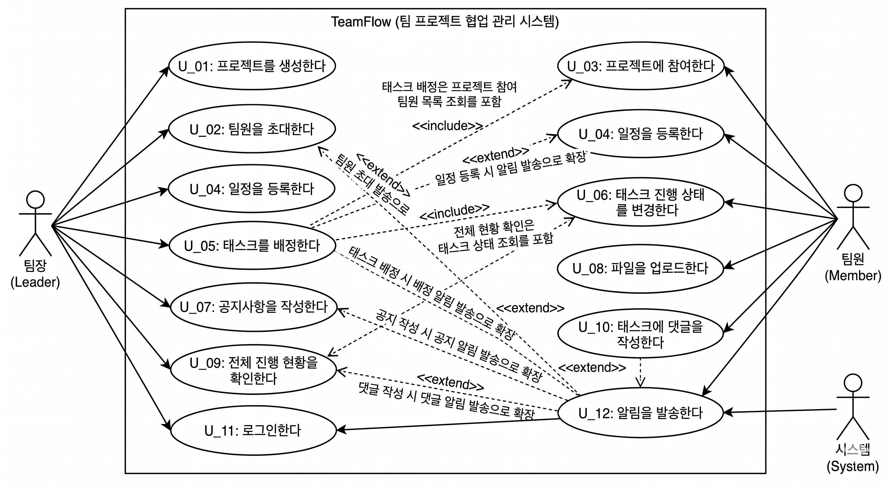

---

### 2.2 기능 분류 및 설명 (Use Case Description)

#### U_01. 프로젝트를 생성한다

| 항목 | 내용 |
|------|------|
| **Use Case Name** | 프로젝트를 생성한다 |
| **ID** | U_01 |
| **중요도** | High |
| **주요 액터** | 팀장 |
| **유형** | Detail, Essential |
| **간단한 설명** | 팀장이 새 프로젝트를 만들고 기본 정보를 입력하는 유스케이스다. |
| **이해관계자 및 관심사** | 팀장: 프로젝트 이름, 설명, 전체 마감일을 등록해서 팀 작업 공간을 만들고 싶다. |
| **트리거** | 팀장이 '프로젝트 생성' 버튼을 누른다. |
| **관계** | Association: 팀장 / Include: - / Extend: - / Generalization: - |
| **정상 흐름** | 1. 팀장은 프로젝트 이름, 설명, 전체 마감일을 입력한다.  2. 팀장은 '생성' 버튼을 누른다.  3. 시스템은 프로젝트를 생성하고 대시보드 화면으로 이동한다. |
| **서브 흐름** | 없음 |
| **대안/예외 흐름** | 2.a1: 프로젝트 이름이 비어 있으면 시스템은 오류 메시지를 출력하고 입력 화면을 유지한다. |

---

#### U_02. 팀원을 초대한다

| 항목 | 내용 |
|------|------|
| **Use Case Name** | 팀원을 초대한다 |
| **ID** | U_02 |
| **중요도** | High |
| **주요 액터** | 팀장 |
| **유형** | Detail, Essential |
| **간단한 설명** | 팀장이 이메일을 통해 특정 사용자를 프로젝트에 초대하는 유스케이스다. |
| **이해관계자 및 관심사** | 팀장: 원하는 사람을 프로젝트에 참여시키고 싶다. |
| **트리거** | 팀장이 '팀원 초대' 버튼을 누른다. |
| **관계** | Association: 팀장 / Include: - / Extend: U_12(초대 알림 발송) / Generalization: - |
| **정상 흐름** | 1. 팀장은 초대할 팀원의 이메일 주소를 입력한다.  2. 팀장은 '초대 전송' 버튼을 누른다.  3. 시스템은 해당 이메일로 초대 알림을 발송한다. |
| **서브 흐름** | 없음 |
| **대안/예외 흐름** | 2.a1: 가입된 계정이 없는 이메일이면 시스템은 '해당 이메일로 가입된 사용자가 없습니다' 메시지를 출력한다. |

---

#### U_03. 프로젝트에 참여한다

| 항목 | 내용 |
|------|------|
| **Use Case Name** | 프로젝트에 참여한다 |
| **ID** | U_03 |
| **중요도** | High |
| **주요 액터** | 팀원 |
| **유형** | Detail, Essential |
| **간단한 설명** | 초대받은 팀원이 초대를 수락하고 프로젝트에 합류하는 유스케이스다. |
| **이해관계자 및 관심사** | 팀원: 받은 초대를 확인하고 수락 또는 거절할 수 있어야 한다. |
| **트리거** | 팀원이 초대 알림 메일의 수락 링크를 클릭한다. |
| **관계** | Association: 팀원 / Include: - / Extend: - / Generalization: - |
| **정상 흐름** | 1. 팀원은 이메일로 받은 초대 링크를 클릭한다.  2. 시스템은 초대 수락 화면을 보여준다.  3-1. 팀원이 '수락' 버튼을 누르면 해당 프로젝트 구성원으로 등록된다. (S-1)  3-2. 팀원이 '거절' 버튼을 누르면 초대가 취소된다. (S-2) |
| **서브 흐름** | S-1 (초대 수락): 시스템은 팀원을 프로젝트 멤버로 등록하고 프로젝트 대시보드로 이동시킨다.  S-2 (초대 거절): 시스템은 초대를 취소 처리하고 팀장에게 거절 알림을 발송한다. |
| **대안/예외 흐름** | 1.a1: 이미 만료된 초대 링크인 경우 시스템은 '초대가 만료되었습니다' 메시지를 출력한다. |

---

#### U_04. 일정을 등록한다

| 항목 | 내용 |
|------|------|
| **Use Case Name** | 일정을 등록한다 |
| **ID** | U_04 |
| **중요도** | High |
| **주요 액터** | 팀장, 팀원 |
| **유형** | Detail, Essential |
| **간단한 설명** | 팀원이 프로젝트 내에 마일스톤이나 세부 일정을 등록하는 유스케이스다. |
| **이해관계자 및 관심사** | 팀장/팀원: 프로젝트 전체 일정을 캘린더에서 한눈에 확인할 수 있어야 한다. |
| **트리거** | 팀원이 캘린더 화면에서 특정 날짜를 선택하거나 '일정 추가' 버튼을 누른다. |
| **관계** | Association: 팀장, 팀원 / Include: - / Extend: U_12(마감 알림 등록) / Generalization: - |
| **정상 흐름** | 1. 팀원은 일정 이름, 날짜, 설명을 입력한다.  2. 팀원은 '저장' 버튼을 누른다.  3. 시스템은 해당 일정을 캘린더에 등록하고, 마감일 기준 3일 전 알림을 자동 설정한다. |
| **서브 흐름** | 없음 |
| **대안/예외 흐름** | 2.a1: 날짜가 입력되지 않으면 시스템은 오류 메시지를 출력한다. |

---

#### U_05. 태스크를 배정한다

| 항목 | 내용 |
|------|------|
| **Use Case Name** | 태스크를 배정한다 |
| **ID** | U_05 |
| **중요도** | High |
| **주요 액터** | 팀장 |
| **유형** | Detail, Essential |
| **간단한 설명** | 팀장이 특정 팀원에게 업무 단위(태스크)를 배정하는 유스케이스다. |
| **이해관계자 및 관심사** | 팀장: 누가 어떤 업무를 맡고 있는지 명확하게 관리하고 싶다. |
| **트리거** | 팀장이 '태스크 추가' 버튼을 누른다. |
| **관계** | Association: 팀장 / Include: U_03(프로젝트 팀원 목록 조회) / Extend: U_12(배정 알림 발송) / Generalization: - |
| **정상 흐름** | 1. 팀장은 태스크 이름, 담당자, 마감일, 설명을 입력한다.  2. 팀장은 '배정' 버튼을 누른다.  3. 시스템은 태스크를 생성하고 담당 팀원에게 배정 알림을 발송한다. |
| **서브 흐름** | 없음 |
| **대안/예외 흐름** | 2.a1: 담당자가 지정되지 않으면 시스템은 '담당자를 선택해주세요' 메시지를 출력한다. |

---

#### U_06. 태스크 진행 상태를 변경한다

| 항목 | 내용 |
|------|------|
| **Use Case Name** | 태스크 진행 상태를 변경한다 |
| **ID** | U_06 |
| **중요도** | High |
| **주요 액터** | 팀원 |
| **유형** | Detail, Essential |
| **간단한 설명** | 팀원이 자신에게 배정된 태스크의 진행 상태를 '할 일 / 진행 중 / 완료'로 변경하는 유스케이스다. |
| **이해관계자 및 관심사** | 팀원: 업무 진척 상황을 팀 전체에 공유하고 싶다. |
| **트리거** | 팀원이 태스크 항목의 상태 드롭다운을 선택한다. |
| **관계** | Association: 팀원 / Include: - / Extend: - / Generalization: - |
| **정상 흐름** | 1. 팀원은 자신의 태스크 목록에서 상태를 변경할 태스크를 선택한다.  2. 팀원은 '할 일 / 진행 중 / 완료' 중 하나를 선택한다.  3. 시스템은 변경된 상태를 저장하고 전체 진행 현황에 반영한다. |
| **서브 흐름** | 없음 |
| **대안/예외 흐름** | 없음 |

---

#### U_07. 공지사항을 작성한다

| 항목 | 내용 |
|------|------|
| **Use Case Name** | 공지사항을 작성한다 |
| **ID** | U_07 |
| **중요도** | High |
| **주요 액터** | 팀장 |
| **유형** | Detail, Essential |
| **간단한 설명** | 팀장이 프로젝트 내 공지사항을 작성하고 팀원들에게 전달하는 유스케이스다. |
| **이해관계자 및 관심사** | 팀장: 중요한 내용을 팀원 전체에게 빠르게 공유하고 싶다. |
| **트리거** | 팀장이 '공지 작성' 버튼을 누른다. |
| **관계** | Association: 팀장 / Include: - / Extend: U_12(공지 알림 발송) / Generalization: - |
| **정상 흐름** | 1. 팀장은 공지 제목과 내용을 입력한다.  2. 팀장은 '등록' 버튼을 누른다.  3. 시스템은 공지를 저장하고 프로젝트 팀원 전원에게 알림을 발송한다. |
| **서브 흐름** | 없음 |
| **대안/예외 흐름** | 2.a1: 제목 또는 내용이 비어 있으면 시스템은 오류 메시지를 출력하고 입력 화면을 유지한다. |

---

#### U_08. 파일을 업로드한다

| 항목 | 내용 |
|------|------|
| **Use Case Name** | 파일을 업로드한다 |
| **ID** | U_08 |
| **중요도** | High |
| **주요 액터** | 팀원 |
| **유형** | Detail, Essential |
| **간단한 설명** | 팀원이 프로젝트 공간에 회의 자료나 참고 문서를 업로드하는 유스케이스다. |
| **이해관계자 및 관심사** | 팀원: 자료를 한 곳에 모아서 다른 팀원들이 쉽게 접근할 수 있으면 좋겠다. |
| **트리거** | 팀원이 '파일 업로드' 버튼을 누른다. |
| **관계** | Association: 팀원 / Include: - / Extend: - / Generalization: - |
| **정상 흐름** | 1. 팀원은 업로드할 파일을 선택한다.  2. 팀원은 '업로드' 버튼을 누른다.  3. 시스템은 파일을 클라우드 스토리지에 저장하고 파일 목록에 추가한다. |
| **서브 흐름** | 없음 |
| **대안/예외 흐름** | 2.a1: 파일 용량이 50MB를 초과하면 시스템은 '파일 크기 초과' 메시지를 출력한다.  2.a2: 업로드 중 네트워크 오류가 생기면 시스템은 '업로드에 실패했습니다. 다시 시도해주세요' 메시지를 출력한다. |

---

#### U_09. 전체 진행 현황을 확인한다

| 항목 | 내용 |
|------|------|
| **Use Case Name** | 전체 진행 현황을 확인한다 |
| **ID** | U_09 |
| **중요도** | High |
| **주요 액터** | 팀장 |
| **유형** | Detail, Essential |
| **간단한 설명** | 팀장이 프로젝트 내 모든 태스크의 진행 상태를 한눈에 파악하는 유스케이스다. |
| **이해관계자 및 관심사** | 팀장: 누가 어떤 업무를 얼마나 진행했는지 전체 현황을 한 화면에서 보고 싶다. |
| **트리거** | 팀장이 대시보드 또는 '진행 현황' 탭을 클릭한다. |
| **관계** | Association: 팀장 / Include: U_06(태스크 상태 조회) / Extend: - / Generalization: - |
| **정상 흐름** | 1. 팀장은 대시보드 화면에 접근한다.  2. 시스템은 프로젝트 내 전체 태스크를 상태별로 분류하여 보여준다.  3. 팀장은 특정 태스크를 클릭해서 상세 정보를 확인할 수 있다. |
| **서브 흐름** | 없음 |
| **대안/예외 흐름** | 없음 |

---

#### U_10. 태스크에 댓글을 작성한다

| 항목 | 내용 |
|------|------|
| **Use Case Name** | 태스크에 댓글을 작성한다 |
| **ID** | U_10 |
| **중요도** | Mid |
| **주요 액터** | 팀원 |
| **유형** | Detail, Essential |
| **간단한 설명** | 팀원이 특정 태스크에 의견이나 진행 메모를 댓글로 남기는 유스케이스다. |
| **이해관계자 및 관심사** | 팀원: 업무 관련 소통 내용을 태스크 단위로 정리해두고 싶다. |
| **트리거** | 팀원이 태스크 상세 화면에서 댓글 입력창을 클릭한다. |
| **관계** | Association: 팀원 / Include: - / Extend: U_12(댓글 알림 발송) / Generalization: - |
| **정상 흐름** | 1. 팀원은 태스크 상세 화면에서 댓글 내용을 입력한다.  2. 팀원은 '등록' 버튼을 누른다.  3. 시스템은 댓글을 저장하고 태스크 담당자에게 알림을 발송한다. |
| **서브 흐름** | 없음 |
| **대안/예외 흐름** | 2.a1: 내용이 비어 있으면 시스템은 등록 버튼을 비활성화한다. |

---

#### U_11. 로그인한다

| 항목 | 내용 |
|------|------|
| **Use Case Name** | 로그인한다 |
| **ID** | U_11 |
| **중요도** | High |
| **주요 액터** | 팀장, 팀원 |
| **유형** | Detail, Essential |
| **간단한 설명** | 사용자가 이메일과 비밀번호로 시스템에 로그인하는 유스케이스다. |
| **이해관계자 및 관심사** | 팀장/팀원: 자신의 계정으로 시스템에 접속하고 싶다. |
| **트리거** | 사용자가 로그인 페이지에서 '로그인' 버튼을 누른다. |
| **관계** | Association: 팀장, 팀원 / Include: - / Extend: - / Generalization: - |
| **정상 흐름** | 1. 사용자는 이메일과 비밀번호를 입력한다.  2. 사용자는 '로그인' 버튼을 누른다.  3-1. 인증 성공 시 대시보드로 이동한다. (S-1)  3-2. 인증 실패 시 오류 메시지를 출력한다. (S-2) |
| **서브 흐름** | S-1 (로그인 성공): 시스템은 세션을 생성하고 대시보드 화면으로 이동시킨다.  S-2 (로그인 실패): 시스템은 '이메일 또는 비밀번호를 확인해주세요' 메시지를 출력한다. |
| **대안/예외 흐름** | 없음 |

---

#### U_12. 알림을 발송한다

| 항목 | 내용 |
|------|------|
| **Use Case Name** | 알림을 발송한다 |
| **ID** | U_12 |
| **중요도** | High |
| **주요 액터** | 시스템 |
| **유형** | Detail, Essential |
| **간단한 설명** | 특정 이벤트(마감 임박, 공지 등록, 태스크 배정, 댓글 등)가 발생하면 시스템이 관련 사용자에게 알림을 발송하는 유스케이스다. |
| **이해관계자 및 관심사** | 시스템: 사용자가 중요한 이벤트를 놓치지 않도록 적시에 알림을 전달해야 한다. |
| **트리거** | 알림 조건이 되는 이벤트가 발생했을 때 (마감 3일 전, 공지 등록, 태스크 배정, 새 댓글 등) |
| **관계** | Association: 시스템 / Include: - / Extend: - / Generalization: - |
| **정상 흐름** | 1. 특정 이벤트가 발생하면 시스템은 알림 대상 사용자를 조회한다.  2. 시스템은 이메일 또는 인앱 알림으로 해당 내용을 발송한다. |
| **서브 흐름** | 없음 |
| **대안/예외 흐름** | 2.a1: 이메일 전송 API 오류 발생 시 알림은 인앱 알림으로만 제공되고, 오류 내용은 시스템 로그에 기록된다. |

---

## 3. 요구사항 명세

### 3.1 정적 분석 (클래스 다이어그램)

유스케이스 설명서의 정상 흐름 및 예외 흐름에 등장하는 명사를 클래스로, 동사를 연산으로 매핑하여 주요 클래스를 식별한다.

**식별된 주요 클래스 및 관계**

- `사용자(User)` — Generalization → `팀장(Leader)`, `팀원(Member)` : 팀장과 팀원은 사용자의 하위 유형
- `사용자` ──1:N── `프로젝트(Project)` : 한 사용자는 여러 프로젝트에 참여 가능
- `프로젝트` ──1:N── `태스크(Task)` : 하나의 프로젝트에 여러 태스크가 포함됨
- `프로젝트` ──1:N── `공지(Notice)` : 하나의 프로젝트에 여러 공지가 등록될 수 있음
- `프로젝트` ──1:N── `파일(File)` : 하나의 프로젝트에 여러 파일이 업로드될 수 있음
- `프로젝트` ──1:N── `일정(Schedule)` : 하나의 프로젝트에 여러 일정이 등록될 수 있음
- `태스크` ──1:N── `댓글(Comment)` : 하나의 태스크에 여러 댓글이 달릴 수 있음
- `태스크` ──N:1── `사용자` : 여러 태스크가 한 사용자에게 배정될 수 있음
- `시스템` ──→── `알림(Notification)` : 시스템이 알림 객체를 생성하여 사용자에게 발송

**① 사용자 계층 다이어그램** — User / Leader / Member 간 상속 관계

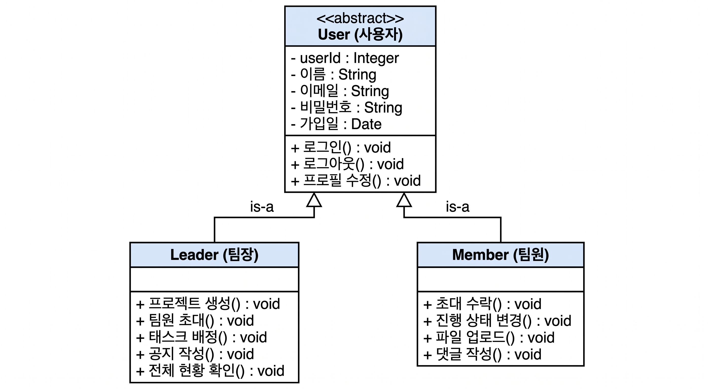

**② 프로젝트 중심 구조 다이어그램** — Project와 Notice / File / Schedule / Leader / Member 간 집합·연관 관계

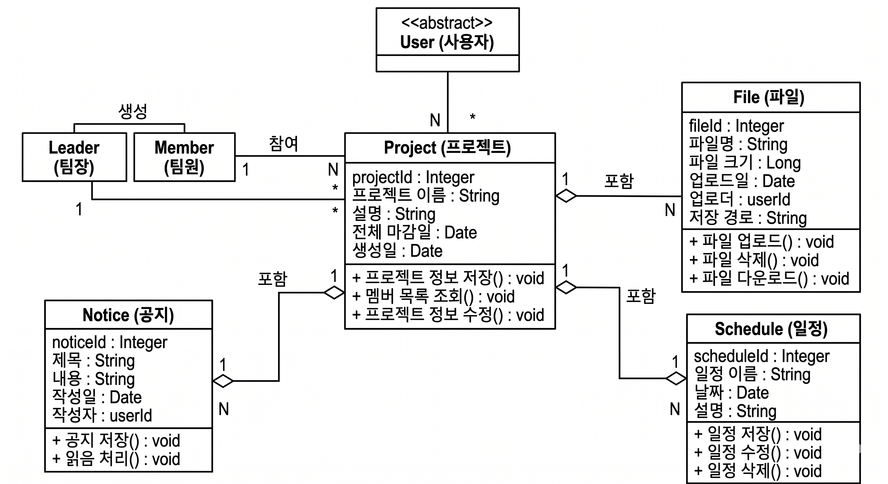

**③ 태스크 상세 구조 다이어그램** — Task / Comment / Member / Notification 간 포함·연관 관계

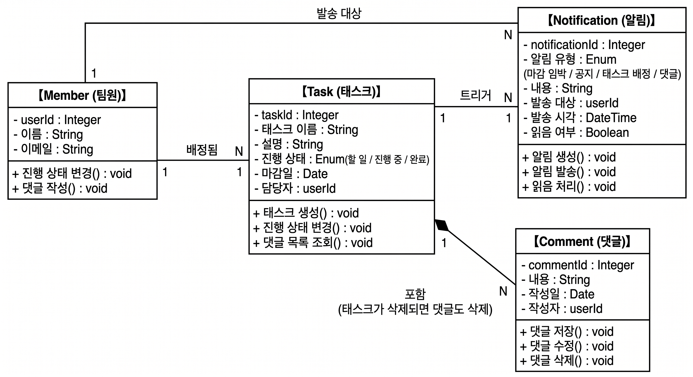

**④ 전체 통합 다이어그램** — 10개 클래스 전체 관계 요약

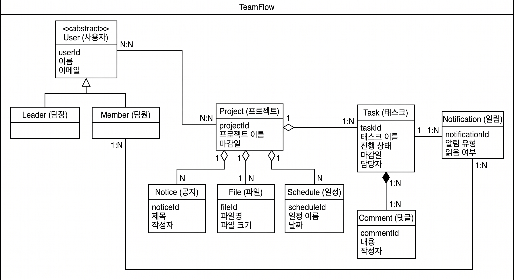

---

### 3.2 CRC 카드

#### Class 01. 사용자 (User)

| 항목 | 내용 |
|------|------|
| **Class Name** | 사용자 (User) |
| **ID** | 01 |
| **Type** | Abstract, Domain |
| **설명** | 시스템에 가입하여 프로젝트에 참여하는 모든 사용자를 추상화한 클래스다. |
| **관련 유스케이스** | U_11 |

| 책임 (Responsibilities) | 협력자 (Collaborators) |
|------------------------|----------------------|
| 로그인() : void | 인증 서비스 |
| 로그아웃() : void | 세션 관리 |
| 프로필 수정() : void | 사용자 DB |

**속성 (Attributes)**
- userId : Integer
- 이름 : String
- 이메일 : String
- 비밀번호 : String (암호화)
- 가입일 : Date

**관계 (Relationships)**
- Generalization (a-kind-of): 팀장, 팀원
- Aggregation (has-parts): -
- Other Associations: 프로젝트, 태스크, 댓글

---

#### Class 02. 팀장 (Leader)

| 항목 | 내용 |
|------|------|
| **Class Name** | 팀장 (Leader) |
| **ID** | 02 |
| **Type** | Concrete, Domain |
| **설명** | 프로젝트를 생성하고 관리하는 권한을 가진 사용자를 나타낸다. |
| **관련 유스케이스** | U_01, U_02, U_05, U_07, U_09 |

| 책임 (Responsibilities) | 협력자 (Collaborators) |
|------------------------|----------------------|
| 프로젝트 생성() : void | 프로젝트 |
| 팀원 초대() : void | 사용자, 알림 |
| 태스크 배정() : void | 태스크, 팀원 |
| 공지 작성() : void | 공지, 알림 |
| 전체 현황 확인() : void | 태스크 |

**속성 (Attributes)**
- (사용자 클래스 속성 상속)

**관계 (Relationships)**
- Generalization (a-kind-of): 사용자
- Aggregation (has-parts): -
- Other Associations: 프로젝트, 태스크, 공지

---

#### Class 03. 팀원 (Member)

| 항목 | 내용 |
|------|------|
| **Class Name** | 팀원 (Member) |
| **ID** | 03 |
| **Type** | Concrete, Domain |
| **설명** | 팀장의 초대로 프로젝트에 참여하며 태스크를 수행하는 사용자를 나타낸다. |
| **관련 유스케이스** | U_03, U_06, U_08, U_10 |

| 책임 (Responsibilities) | 협력자 (Collaborators) |
|------------------------|----------------------|
| 초대 수락() : void | 프로젝트 |
| 초대 거절() : void | 알림 |
| 진행 상태 변경() : void | 태스크 |
| 파일 업로드() : void | 파일 |
| 댓글 작성() : void | 댓글, 알림 |

**속성 (Attributes)**
- (사용자 클래스 속성 상속)

**관계 (Relationships)**
- Generalization (a-kind-of): 사용자
- Aggregation (has-parts): -
- Other Associations: 프로젝트, 태스크, 파일, 댓글

---

#### Class 04. 프로젝트 (Project)

| 항목 | 내용 |
|------|------|
| **Class Name** | 프로젝트 (Project) |
| **ID** | 04 |
| **Type** | Concrete, Domain |
| **설명** | 팀 프로젝트의 기본 단위로, 일정·태스크·공지·파일을 포함하는 컨테이너 역할을 한다. |
| **관련 유스케이스** | U_01, U_02, U_03, U_09 |

| 책임 (Responsibilities) | 협력자 (Collaborators) |
|------------------------|----------------------|
| 프로젝트 정보 저장() : void | 프로젝트 DB |
| 멤버 목록 조회() : void | 팀장, 팀원 |
| 프로젝트 정보 수정() : void | 팀장 |

**속성 (Attributes)**
- projectId : Integer
- 프로젝트 이름 : String
- 설명 : String
- 전체 마감일 : Date
- 생성일 : Date

**관계 (Relationships)**
- Generalization (a-kind-of): -
- Aggregation (has-parts): 태스크, 공지, 파일, 일정
- Other Associations: 사용자

---

#### Class 05. 태스크 (Task)

| 항목 | 내용 |
|------|------|
| **Class Name** | 태스크 (Task) |
| **ID** | 05 |
| **Type** | Concrete, Domain |
| **설명** | 팀 프로젝트 내에서 특정 팀원에게 배정되는 개별 업무 단위를 나타낸다. |
| **관련 유스케이스** | U_05, U_06, U_09 |

| 책임 (Responsibilities) | 협력자 (Collaborators) |
|------------------------|----------------------|
| 태스크 생성() : void | 팀장 |
| 진행 상태 변경() : void | 팀원 |
| 담당자 조회() : void | 사용자 |
| 댓글 목록 조회() : void | 댓글 |

**속성 (Attributes)**
- taskId : Integer
- 태스크 이름 : String
- 설명 : String
- 진행 상태 : Enum (할 일 / 진행 중 / 완료)
- 마감일 : Date
- 담당자 : userId (FK)

**관계 (Relationships)**
- Generalization (a-kind-of): -
- Aggregation (has-parts): 댓글
- Other Associations: 프로젝트, 사용자

---

#### Class 06. 공지 (Notice)

| 항목 | 내용 |
|------|------|
| **Class Name** | 공지 (Notice) |
| **ID** | 06 |
| **Type** | Concrete, Domain |
| **설명** | 팀장이 팀원 전체에게 전달할 내용을 등록하는 공지사항 객체다. |
| **관련 유스케이스** | U_07 |

| 책임 (Responsibilities) | 협력자 (Collaborators) |
|------------------------|----------------------|
| 공지 저장() : void | 공지 DB |
| 읽음 처리() : void | 팀원 |

**속성 (Attributes)**
- noticeId : Integer
- 제목 : String
- 내용 : String
- 작성일 : Date
- 작성자 : userId (FK)

**관계 (Relationships)**
- Generalization (a-kind-of): -
- Aggregation (has-parts): -
- Other Associations: 프로젝트, 알림

---

#### Class 07. 파일 (File)

| 항목 | 내용 |
|------|------|
| **Class Name** | 파일 (File) |
| **ID** | 07 |
| **Type** | Concrete, Domain |
| **설명** | 팀원이 프로젝트에 업로드한 문서, 이미지, PDF 등의 파일 정보를 나타낸다. |
| **관련 유스케이스** | U_08 |

| 책임 (Responsibilities) | 협력자 (Collaborators) |
|------------------------|----------------------|
| 파일 업로드() : void | 클라우드 스토리지 |
| 파일 삭제() : void | 팀원 |
| 파일 다운로드() : void | 팀원 |

**속성 (Attributes)**
- fileId : Integer
- 파일명 : String
- 파일 크기 : Long
- 업로드일 : Date
- 업로더 : userId (FK)
- 저장 경로 : String (URL)

**관계 (Relationships)**
- Generalization (a-kind-of): -
- Aggregation (has-parts): -
- Other Associations: 프로젝트, 외부 스토리지

---

#### Class 08. 일정 (Schedule)

| 항목 | 내용 |
|------|------|
| **Class Name** | 일정 (Schedule) |
| **ID** | 08 |
| **Type** | Concrete, Domain |
| **설명** | 프로젝트 내에서 캘린더에 등록되는 마일스톤 또는 세부 일정 정보를 나타낸다. |
| **관련 유스케이스** | U_04 |

| 책임 (Responsibilities) | 협력자 (Collaborators) |
|------------------------|----------------------|
| 일정 저장() : void | 일정 DB |
| 일정 수정() : void | 팀원 |
| 일정 삭제() : void | 팀원 |

**속성 (Attributes)**
- scheduleId : Integer
- 일정 이름 : String
- 날짜 : Date
- 설명 : String

**관계 (Relationships)**
- Generalization (a-kind-of): -
- Aggregation (has-parts): -
- Other Associations: 프로젝트, 알림

---

#### Class 09. 댓글 (Comment)

| 항목 | 내용 |
|------|------|
| **Class Name** | 댓글 (Comment) |
| **ID** | 09 |
| **Type** | Concrete, Domain |
| **설명** | 특정 태스크에 팀원이 남기는 의견 또는 메모를 나타낸다. |
| **관련 유스케이스** | U_10 |

| 책임 (Responsibilities) | 협력자 (Collaborators) |
|------------------------|----------------------|
| 댓글 저장() : void | 댓글 DB |
| 댓글 수정() : void | 팀원 |
| 댓글 삭제() : void | 팀원 |

**속성 (Attributes)**
- commentId : Integer
- 내용 : String
- 작성일 : Date
- 작성자 : userId (FK)

**관계 (Relationships)**
- Generalization (a-kind-of): -
- Aggregation (has-parts): -
- Other Associations: 태스크, 알림

---

#### Class 10. 알림 (Notification)

| 항목 | 내용 |
|------|------|
| **Class Name** | 알림 (Notification) |
| **ID** | 10 |
| **Type** | Concrete, Domain |
| **설명** | 시스템이 특정 이벤트 발생 시 생성하여 대상 사용자에게 전달하는 알림 객체다. |
| **관련 유스케이스** | U_12 |

| 책임 (Responsibilities) | 협력자 (Collaborators) |
|------------------------|----------------------|
| 알림 생성() : void | 시스템 |
| 알림 발송() : void | 이메일 API |
| 읽음 처리() : void | 사용자 |

**속성 (Attributes)**
- notificationId : Integer
- 알림 유형 : Enum (마감 임박 / 공지 / 태스크 배정 / 댓글)
- 내용 : String
- 발송 대상 : userId (FK)
- 발송 시각 : DateTime
- 읽음 여부 : Boolean

**관계 (Relationships)**
- Generalization (a-kind-of): -
- Aggregation (has-parts): -
- Other Associations: 사용자, 이메일 API

---

### 3.3 동적 분석 (순차 다이어그램)

ch08 강의자료의 ABCD 규칙에 따라 참여 객체를 Actor → Boundary → Control → Data 순으로 왼쪽부터 나열한다.

#### 3.3.1 프로젝트를 생성한다 (U_01)

**참여 객체**

| 구분 | 객체 |
|------|------|
| Actor | 팀장 |
| Boundary | ProjectCreateUI (프로젝트 생성 화면) |
| Control | ProjectController (프로젝트 관리자) |
| Data | ProjectDB (프로젝트 DB) |

**메시지 흐름**

1. 팀장 → ProjectCreateUI : 프로젝트 이름, 설명, 마감일 입력 후 '생성' 클릭
2. ProjectCreateUI → ProjectController : createProject(name, description, deadline)
3. ProjectController → ProjectDB : save(projectData)
4. ProjectDB → ProjectController : return projectId
5. ProjectController → ProjectCreateUI : success
6. ProjectCreateUI → 팀장 : 대시보드 화면으로 이동

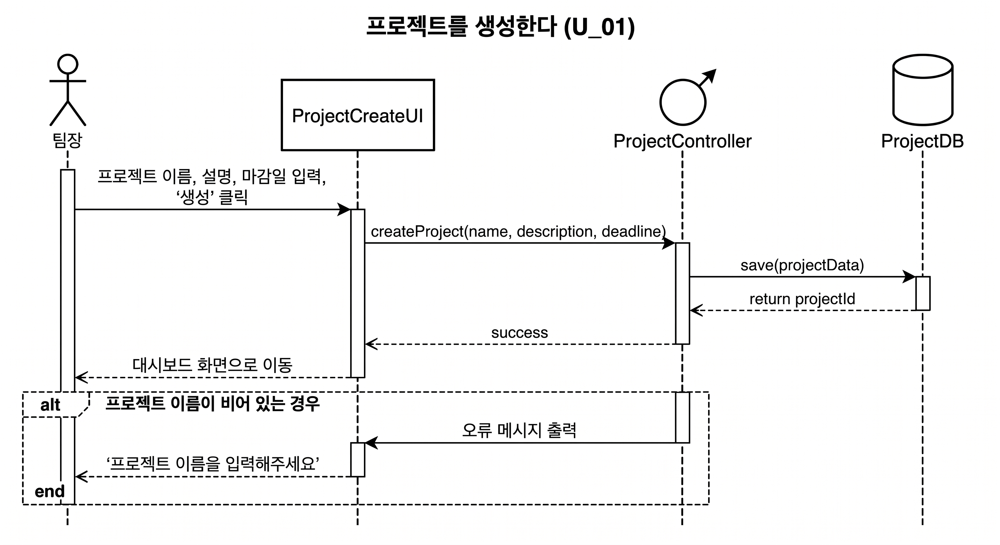
---

#### 3.3.2 팀원을 초대한다 (U_02)

**참여 객체**

| 구분 | 객체 |
|------|------|
| Actor | 팀장 |
| Boundary | InviteUI (팀원 초대 화면) |
| Control | InviteController (초대 관리자) |
| Data | UserDB (사용자 DB), Notification (알림) |

**메시지 흐름**

1. 팀장 → InviteUI : 초대할 이메일 입력 후 '초대 전송' 클릭
2. InviteUI → InviteController : sendInvite(email, projectId)
3. InviteController → UserDB : findByEmail(email)
4. UserDB → InviteController : return userInfo
5. InviteController → Notification : sendInviteEmail(userInfo, projectId)
6. Notification → 팀원 : 초대 이메일 발송
7. InviteController → InviteUI : success

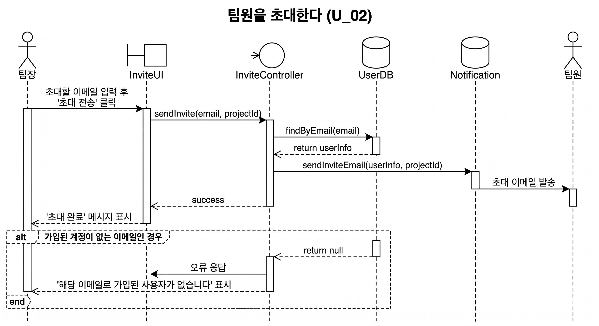
---

#### 3.3.3 태스크를 배정한다 (U_05)

**참여 객체**

| 구분 | 객체 |
|------|------|
| Actor | 팀장 |
| Boundary | TaskCreateUI (태스크 생성 화면) |
| Control | TaskController (태스크 관리자) |
| Data | TaskDB (태스크 DB), Notification (알림) |

**메시지 흐름**

1. 팀장 → TaskCreateUI : 태스크 이름, 담당자, 마감일 입력 후 '배정' 클릭
2. TaskCreateUI → TaskController : createTask(name, assignee, deadline)
3. TaskController → TaskDB : save(taskData)
4. TaskDB → TaskController : return taskId
5. TaskController → Notification : sendAssignNotice(assignee, taskId)
6. Notification → 팀원 : 태스크 배정 알림 발송
7. TaskController → TaskCreateUI : success

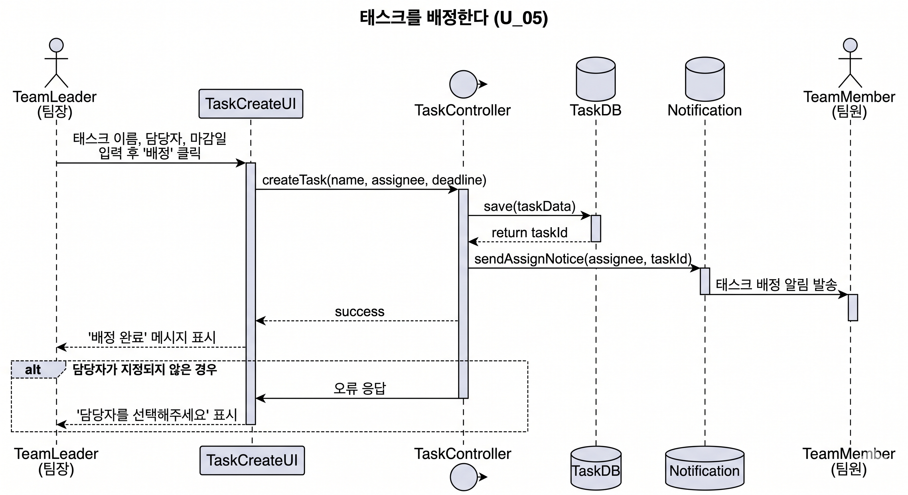
---

#### 3.3.4 태스크 진행 상태를 변경한다 (U_06)

**참여 객체**

| 구분 | 객체 |
|------|------|
| Actor | 팀원 |
| Boundary | TaskListUI (태스크 목록 화면) |
| Control | TaskController (태스크 관리자) |
| Data | TaskDB (태스크 DB) |

**메시지 흐름**

1. 팀원 → TaskListUI : 태스크 선택 후 드롭다운에서 상태 선택
2. TaskListUI → TaskController : updateStatus(taskId, newStatus)
3. TaskController → TaskDB : update(taskId, status)
4. TaskDB → TaskController : return updated
5. TaskController → TaskListUI : success
6. TaskListUI → 팀원 : 변경된 상태 화면에 반영

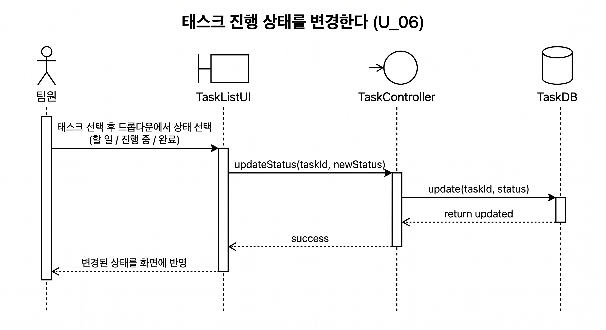
---

#### 3.3.5 공지사항을 작성한다 (U_07)

**참여 객체**

| 구분 | 객체 |
|------|------|
| Actor | 팀장 |
| Boundary | NoticeCreateUI (공지 작성 화면) |
| Control | NoticeController (공지 관리자) |
| Data | NoticeDB (공지 DB), Notification (알림) |

**메시지 흐름**

1. 팀장 → NoticeCreateUI : 제목, 내용 입력 후 '등록' 클릭
2. NoticeCreateUI → NoticeController : createNotice(title, content)
3. NoticeController → NoticeDB : save(noticeData)
4. NoticeDB → NoticeController : return noticeId
5. NoticeController → Notification : sendNoticeAlert(projectMembers, noticeId)
6. Notification → 팀원 : 공지 등록 알림 발송
7. NoticeController → NoticeCreateUI : success

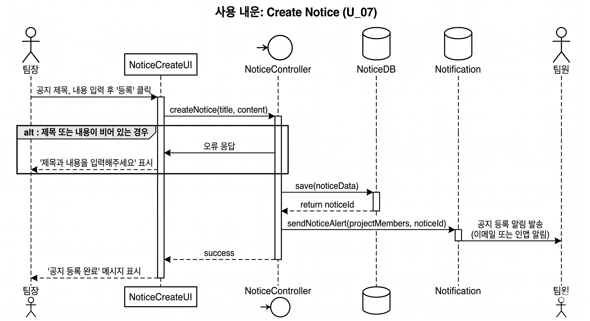
---

#### 3.3.6 알림을 발송한다 (U_12)

**참여 객체**

| 구분 | 객체 |
|------|------|
| Actor | 시스템 (스케줄러) |
| Boundary | - (백엔드 내부 처리) |
| Control | NotificationController (알림 관리자) |
| Data | UserDB (사용자 DB), 이메일 API |

**메시지 흐름**

1. 시스템 → NotificationController : triggerEvent(eventType, targetId)
2. NotificationController → UserDB : getTargetUsers(projectId)
3. UserDB → NotificationController : return userList
4. NotificationController → 이메일 API : sendEmail(userList, message)
5. 이메일 API → 사용자 : 알림 이메일 발송

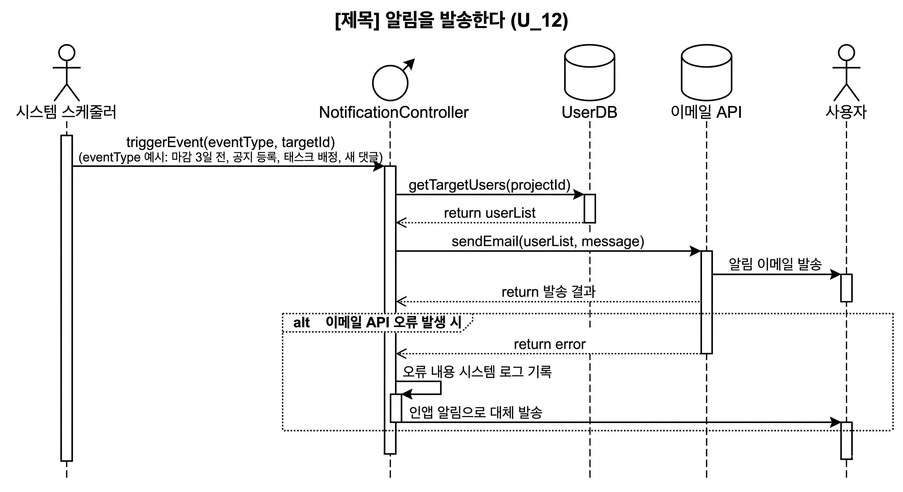
---

## 4. 인터페이스 분석

| 인터페이스 | 유형 | 설명 |
|-----------|------|------|
| 클라우드 스토리지 (AWS S3 / Firebase Storage) | 외부 시스템 인터페이스 | 팀원이 업로드한 파일을 저장하고 다운로드 URL을 제공한다. |
| 이메일 전송 API (SendGrid 등) | 외부 시스템 인터페이스 | 초대 알림, 마감 알림, 공지 알림, 태스크 배정 알림을 이메일로 발송한다. |
| 웹 브라우저 | 사용자 인터페이스 | React 기반 웹 UI를 통해 모든 기능을 제공한다. Chrome, Firefox, Safari, Edge 최신 버전을 지원한다. |

---

## 5. 제약사항

| ID | 유형 | 제약사항 |
|----|------|---------|
| C_01 | 운영 환경 | 시스템은 네트워크 연결 시에만 작동한다. |
| C_02 | 운영 환경 | Chrome, Firefox, Safari, Edge 최신 버전의 웹 브라우저에서 동작해야 한다. |
| C_03 | 운영 환경 | 모바일 화면(375px 이상)에서도 정상적으로 표시되어야 한다. |
| C_04 | 성능 | 모든 사용자 요청에 대해 3초 이내로 응답해야 한다. |
| C_05 | 성능 | 동시에 100명 이상의 사용자 요청을 처리할 수 있어야 한다. |
| C_06 | 성능 | 파일 업로드는 개당 최대 50MB까지 지원한다. |
| C_07 | 보안 | 사용자 비밀번호는 반드시 암호화하여 저장한다. |
| C_08 | 보안 | 사용자는 자신이 참여한 프로젝트의 데이터에만 접근할 수 있다. |
| C_09 | 보안 | 세션 만료 시 자동으로 로그아웃 처리한다. |
| C_10 | 개발 | 프론트엔드는 React, 백엔드는 Spring Boot(Java) 또는 Node.js, DB는 PostgreSQL을 사용한다. |

---

## 6. 요구사항 추적표

| 요구사항 ID | 요구사항 설명 | U01 | U02 | U03 | U04 | U05 | U06 | U07 | U08 | U09 | U10 | U11 | U12 |
|------------|-------------|:---:|:---:|:---:|:---:|:---:|:---:|:---:|:---:|:---:|:---:|:---:|:---:|
| FR-001 | 사용자는 이름, 이메일, 비밀번호로 회원가입할 수 있다. | | | | | | | | | | | ○ | |
| FR-002 | 사용자는 이메일과 비밀번호로 로그인한다. | | | | | | | | | | | ○ | |
| FR-005 | 팀장은 프로젝트를 생성할 수 있다. | ○ | | | | | | | | | | | |
| FR-006 | 팀장은 이메일로 팀원을 초대할 수 있다. | | ○ | | | | | | | | | | ○ |
| FR-007 | 팀원은 초대를 수락하거나 거절할 수 있다. | | | ○ | | | | | | | | | |
| FR-010 | 팀원은 프로젝트 내 세부 일정을 등록할 수 있다. | | | | ○ | | | | | | | | ○ |
| FR-011 | 팀원은 등록된 일정을 캘린더로 확인할 수 있다. | | | | ○ | | | | | | | | |
| FR-014 | 팀장은 팀원에게 태스크를 배정할 수 있다. | | | | | ○ | | | | | | | ○ |
| FR-015 | 팀원은 자신의 태스크 목록을 확인할 수 있다. | | | | | | ○ | | | | | | |
| FR-016 | 팀원은 태스크 진행 상태를 변경할 수 있다. | | | | | | ○ | | | | | | |
| FR-018 | 팀장은 전체 태스크 진행 상태를 확인할 수 있다. | | | | | | | | | ○ | | | |
| FR-019 | 팀장은 공지사항을 작성하고 등록할 수 있다. | | | | | | | ○ | | | | | ○ |
| FR-020 | 팀원은 등록된 공지사항을 확인할 수 있다. | | | | | | | ○ | | | | | |
| FR-022 | 팀원은 프로젝트 내 파일을 업로드할 수 있다. | | | | | | | | ○ | | | | |
| FR-023 | 팀원은 업로드된 파일을 다운로드할 수 있다. | | | | | | | | ○ | | | | |
| FR-026 | 시스템은 마감일 3일 전에 알림을 발송한다. | | | | | | | | | | | | ○ |
| FR-027 | 시스템은 새 공지 등록 시 팀원에게 알림을 발송한다. | | | | | | | ○ | | | | | ○ |
| FR-028 | 시스템은 태스크 배정 시 해당 팀원에게 알림을 발송한다. | | | | | ○ | | | | | | | ○ |
| FR-029 | 팀원은 태스크에 댓글을 작성할 수 있다. | | | | | | | | | | ○ | | ○ |

---

## 7. 참고문헌 및 부록

**참고문헌**

- [1] [dovob213]시스템정의서_Doc001.md
- [2] [dovob213]프로젝트관리계획서_Doc002.md
- [3] [dovob213]요구사항정의서_20260502_Doc003.md
- [4] 샘플_요구사항분석서.pdf (수업 제공 참고 자료)
- [5] ch08_객체지향_분석.pdf (소프트웨어공학 강의자료, 2026)

---

### 부록 A. 산출물 간 일관성 점검

ch08 강의자료 기준에 따라 분석 산출물 간 일관성을 점검한다.

| 점검 대상 | 점검 내용 | 결과 |
|---------|---------|------|
| 기능 모델 ↔ 구조 모델 | 유스케이스 설명서에 등장하는 클래스명이 CRC 카드에 모두 정의되어 있는지 확인 | 사용자, 팀장, 팀원, 프로젝트, 태스크, 공지, 파일, 일정, 댓글, 알림 총 10개 클래스 정의 완료 |
| 기능 모델 ↔ 행위 모델 | 각 유스케이스가 순차 다이어그램으로 표현되었는지 확인 |  U_01, U_02, U_05, U_06, U_07, U_12 총 6개 주요 시나리오 작성 완료 |
| 구조 모델 ↔ 행위 모델 | 순차 다이어그램에서 주고받는 메시지가 CRC 카드의 책임(연산)으로 정의되어 있는지 확인 |  save(), update(), sendEmail() 등 주요 메시지가 연산으로 정의 완료 |