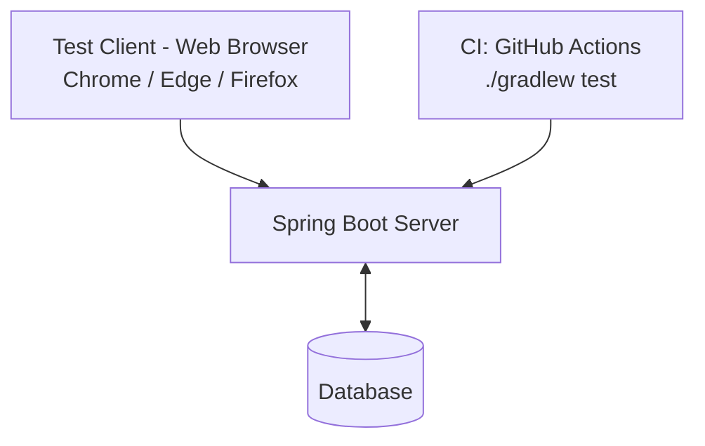

# [ TeamFlow ] 테스트 결과 보고서

---

**문서번호** : [dovob213]테스트결과보고서_20260615_Doc005
**소 속** :
**팀 명** :
**팀 원** :
**교 수** : 오명원 교수님

---

## 제/개정 이력

| 버전 | 날짜         | 작성자 성명 | 제/개정사항 | 비고 |
|------|------------|--------|------------|------|
| 1.0 | 2026.06.15 | (정찬영)  | 테스트 결과 보고서 최초 작성 | 제정 |
| |            |        | | |

---

## 목차

1. 서론
    - 1.1 문서 목적 및 범위
    - 1.2 프로젝트 개요
    - 1.3 용어 정의
    - 1.4 참조 문서
2. 테스트 개요
    - 2.1 테스트 범위
    - 2.2 테스트 항목 및 통과 기준
3. 테스트 케이스 (블랙박스)
    - 3.1 테스트 케이스 선정
    - 3.2 테스트 케이스 유형
    - 3.3 테스트 케이스 목록
4. 단위 테스트 설계 (화이트박스)
    - 4.1 커버리지 기준
    - 4.2 단위 테스트 케이스
5. 테스트 예외사항
    - 5.1 중단 기준과 재개 조건
6. 테스트 환경
    - 6.1 테스트 환경 구성도
7. 테스트 결과
8. 부록

---

## 1. 서론

### 1.1 문서 목적 및 범위

이 문서는 대학생 팀 프로젝트 협업 지원 시스템 'TeamFlow'에 대한 테스팅을 수행하고 그 결과를 정리한 문서다. 요구사항 정의서와 분석서에서 도출한 기능을 기준으로 테스트 기준, 테스트 범위, 테스트 케이스, 그리고 그 결과를 명시한다.

테스트는 크게 두 관점으로 진행한다. 사용자 입장에서 시스템이 요구사항대로 동작하는지 확인하는 **블랙박스 테스트**(3장), 그리고 핵심 비즈니스 로직의 내부 분기를 검증하는 **화이트박스 단위 테스트**(4장)다.

### 1.2 프로젝트 개요

TeamFlow는 대학생 팀 프로젝트 진행에 필요한 일정 관리, 역할 분담, 공지 확인, 파일 공유, 진행률 확인 기능을 하나로 통합한 웹 기반 협업 관리 시스템이다. 카카오톡, 구글 드라이브, Notion 등 여러 도구에 흩어져 있던 협업 정보를 한 플랫폼으로 모아, 팀원 간 소통의 비효율을 줄이고 프로젝트 현황을 쉽게 파악할 수 있도록 한다.

서버는 Spring Boot 기반으로 구현되며, 클라이언트는 웹 브라우저를 통해 접근한다. 데이터는 관계형 데이터베이스에 저장된다.

### 1.3 용어 정의

| 용어 | 설명 |
|------|------|
| 팀장 | 프로젝트를 생성하고 팀원을 초대하며, 태스크 배정·공지 작성을 수행하는 역할 |
| 팀원 | 팀장의 초대로 프로젝트에 참여하며 태스크 상태를 갱신하는 역할 |
| 태스크(Task) | 팀원에게 배정되는 단위 업무. '할 일 / 진행 중 / 완료' 상태를 가진다 |
| 블랙박스 테스트 | 내부 구조를 모른다는 가정 하에 입력과 출력만으로 동작을 검증하는 방식 |
| 화이트박스 테스트 | 코드 내부 구조(분기, 조건)를 알고 그 경로를 검증하는 방식 |
| 커버리지(Coverage) | 테스트가 코드의 어느 부분을 얼마나 실행했는지 나타내는 척도 |

### 1.4 참조 문서

1. [dovob213]요구사항정의서_20260502_Doc003.md
2. [dovob213]요구사항분석서_20260513_Doc004.md
3. 샘플_테스트결과서.pdf (수업 참고 자료)
4. ch00_TDD.pdf, ch14_화이트박스_테스트.pdf (소프트웨어공학 강의자료, 2026)

---

## 2. 테스트 개요

### 2.1 테스트 범위

블랙박스 테스트는 시스템 내부를 모른다는 가정 하에 사용자 시나리오 중심으로 이루어진다. 화이트박스 테스트는 핵심 로직 모듈에 한해 단위 테스트(JUnit)로 분기를 검증한다. 테스트 범위는 아래와 같다.

| 범위 | 내용 |
|------|------|
| Web 기반 시스템 | Ⅰ. 브라우저/서버 동작 정확성 확인<br>Ⅱ. 요구사항 충족 확인 |
| Server / Business Logic | Ⅰ. 입력값 검증·상태 전이 로직의 분기 정확성 확인<br>Ⅱ. 단위 테스트 커버리지 확보 |
| Database | Ⅰ. 데이터 입출력 및 연동 확인<br>Ⅱ. 권한별 접근 제어 확인 |

### 2.2 테스트 항목 및 통과 기준

**기능별 테스트 항목**

| 기능 | 통과 기준 |
|------|----------|
| 회원가입 | 올바른 형식의 이메일/비밀번호만 가입에 성공한다 |
| 로그인 | DB에 저장된 올바른 회원정보만 로그인에 성공한다 |
| 프로젝트 생성 | 필수 정보 입력 시 프로젝트가 생성되고 목록에 표시된다 |
| 팀원 초대 | 유효한 이메일로 초대가 발송되고, 수락 시 팀원이 추가된다 |
| 태스크 관리 | 배정된 태스크가 해당 팀원에게 표시되고 상태 변경이 반영된다 |
| 공지사항 | 등록된 공지가 팀원에게 표시되고 알림이 발송된다 |
| 파일 공유 | 업로드·다운로드·삭제가 정상 동작하고 목록에 반영된다 |
| 알림 | 마감일 임박 시 알림이 정확한 시점에 발송된다 |

**비기능별 테스트 항목**

| 항목 | 통과 기준 |
|------|----------|
| 브라우저 호환성 | Chrome / Edge / Firefox에서 정상 동작한다 |
| 응답 성능 | 주요 화면이 2초 이내에 응답한다 |
| 보안 | 로그인하지 않은 사용자, 권한 없는 사용자가 자원에 접근할 수 없다 |

---

## 3. 테스트 케이스 (블랙박스)

### 3.1 테스트 케이스 선정

테스트 케이스는 2.2의 기능별 테스트 항목에 따라 선정했다. 블랙박스 기법 중 **동등 분할**과 **경계값 분석**을 적용해, 유효/무효 입력을 대표하는 값과 경계 지점을 중심으로 케이스를 구성했다. 시스템 내부 구조를 보지 않는 사용자 시점 검증에 중점을 둔다.

### 3.2 테스트 케이스 유형

- 입력값 검증을 위한 문자열 입력 테스트 케이스 (회원가입, 로그인)
- 기능 동작 확인을 위한 동작 테스트 케이스 (프로젝트, 태스크, 공지, 파일)
- 권한·접근 제어 확인을 위한 보안 테스트 케이스

### 3.3 테스트 케이스 목록

#### 3.3.1 회원가입 기능

입력값은 문자 그대로 입력한다.

| case | 이름 | 이메일 | 비밀번호 | 예상 결과값 |
|------|------|--------|----------|------------|
| T1 | 홍길동 | hong@test.com | Pass1234! | SUCCESS |
| T2 | 홍길동 | hongtest.com | Pass1234! | FAIL (이메일 형식 오류) |
| T3 | 홍길동 | hong@test.com | 123 | FAIL (비밀번호 8자 미만) |
| T4 | (빈칸) | hong@test.com | Pass1234! | FAIL (필수값 누락) |
| T5 | 홍길동 | hong@test.com | Pass1234! | FAIL (이미 가입된 이메일) |

#### 3.3.2 로그인 기능

DB에 저장된 올바른 값은 이메일 `hong@test.com`, 비밀번호 `Pass1234!` 이다.

| case | 이메일 | 비밀번호 | 예상 결과값 |
|------|--------|----------|------------|
| T6 | hong@test.com | Pass1234! | SUCCESS |
| T7 | hong@test.com | wrong123 | FAIL |
| T8 | none@test.com | Pass1234! | FAIL |

#### 3.3.3 프로젝트 생성 기능

| case | 내용 | 예상 결과값 |
|------|------|------------|
| T9 | 이름·설명·마감일을 모두 입력하면 프로젝트가 생성되는가? | YES |
| T10 | 프로젝트 이름을 빈칸으로 두면 생성이 거부되는가? | YES |
| T11 | 마감일을 과거 날짜로 입력하면 거부되는가? | YES |

#### 3.3.4 팀원 초대 기능

| case | 내용 | 예상 결과값 |
|------|------|------------|
| T12 | 가입된 이메일로 초대 시 초대가 발송되는가? | YES |
| T13 | 초대를 수락하면 팀원 목록에 추가되는가? | YES |
| T14 | 초대를 거절하면 팀원으로 추가되지 않는가? | YES |

#### 3.3.5 태스크 관리 기능

| case | 내용 | 예상 결과값 |
|------|------|------------|
| T15 | 팀장이 배정한 태스크가 해당 팀원 목록에 표시되는가? | YES |
| T16 | 상태를 '진행 중'으로 변경 시 정상 반영되는가? | YES |
| T17 | 상태를 '완료'로 변경 시 전체 진행률이 갱신되는가? | YES |
| T18 | 태스크 배정 시 해당 팀원에게 알림이 발송되는가? | YES |

#### 3.3.6 공지사항 기능

| case | 내용 | 예상 결과값 |
|------|------|------------|
| T19 | 작성한 공지가 팀원에게 표시되는가? | YES |
| T20 | 새 공지 등록 시 팀원에게 알림이 발송되는가? | YES |
| T21 | 공지를 확인하면 읽음 처리가 표시되는가? | YES |

#### 3.3.7 파일 공유 기능

| case | 내용 | 예상 결과값 |
|------|------|------------|
| T22 | 업로드한 파일이 목록에 표시되는가? | YES |
| T23 | 업로드된 파일이 정상 다운로드되는가? | YES |
| T24 | 본인이 업로드한 파일을 삭제하면 목록에서 제거되는가? | YES |

#### 3.3.8 알림 기능

| case | 내용 | 예상 결과값 |
|------|------|------------|
| T25 | 마감일 3일 전에 알림이 발송되는가? | YES |

#### 3.3.9 보안 테스트

| case | 내용 | 예상 결과값 |
|------|------|------------|
| T26 | 로그인하지 않은 사용자가 시스템을 사용할 수 없는가? | YES |
| T27 | 해당 프로젝트 팀원이 아닌 사용자의 접근이 차단되는가? | YES |

---

## 4. 단위 테스트 설계 (화이트박스)

블랙박스 테스트가 사용자 관점이라면, 단위 테스트는 코드 내부 분기를 직접 검증한다. TeamFlow에서 입력 검증이 집중된 회원가입 검증 로직(`UserValidator.validateSignup`)을 대상으로 화이트박스 단위 테스트를 설계한다.

### 4.1 커버리지 기준

강의자료(ch14)의 커버리지 기준 중 **분기 커버리지(Branch Coverage)**를 목표로 한다. 즉, 검증 로직의 모든 조건문이 참(true)과 거짓(false) 양쪽으로 최소 한 번씩 실행되도록 테스트 케이스를 설계한다.

대상 메서드 가정:

```java
public boolean validateSignup(String name, String email, String password) {
    if (name == null || name.isBlank()) return false;        // 분기 ①
    if (!email.matches(EMAIL_REGEX)) return false;           // 분기 ②
    if (password.length() < 8) return false;                 // 분기 ③
    if (userRepository.existsByEmail(email)) return false;   // 분기 ④
    return true;                                             // 정상 경로
}
```

### 4.2 단위 테스트 케이스

각 케이스는 위 분기 중 하나를 거짓 경로로 통과시키도록 설계해, 모든 분기를 커버한다. (JUnit 5 기준)

| case | 대상 분기 | 입력 (name / email / password) | 기대 반환값 |
|------|----------|-------------------------------|------------|
| U1 | 정상 경로 | 홍길동 / hong@test.com / Pass1234! | true |
| U2 | 분기 ① true | (빈칸) / hong@test.com / Pass1234! | false |
| U3 | 분기 ② true | 홍길동 / hongtest.com / Pass1234! | false |
| U4 | 분기 ③ true | 홍길동 / hong@test.com / 123 | false |
| U5 | 분기 ④ true | 홍길동 / dup@test.com / Pass1234! | false |

> U1~U5를 모두 실행하면 4개 조건문이 참/거짓 양방향으로 실행되어 **분기 커버리지 100%**를 달성한다.

테스트 코드 예시:

```java
@Test
void 정상_입력이면_가입에_성공한다() {
    boolean result = validator.validateSignup("홍길동", "hong@test.com", "Pass1234!");
    assertThat(result).isTrue();   // U1
}

@Test
void 이메일_형식이_틀리면_실패한다() {
    boolean result = validator.validateSignup("홍길동", "hongtest.com", "Pass1234!");
    assertThat(result).isFalse();  // U3
}
```

---

## 5. 테스트 예외사항

### 5.1 중단 기준과 재개 조건

| 중단 기준 | 재개 조건 |
|----------|----------|
| 서버가 응답하지 않거나 DB 연결이 끊겨 다수 케이스가 연속 실패할 때 | 서버·DB 연결을 복구한 뒤, 실패 지점부터 테스트를 재개한다 |
| 시스템 input type과 다른 입력이 들어와 후속 검증이 불가능할 때 | 입력을 중단하고 기존 데이터로 시스템을 재개한다 |

---

## 6. 테스트 환경

### 6.1 테스트 환경 구성도

테스트 클라이언트는 웹 브라우저를 통해 Spring Boot 서버에 접근하며, 서버는 데이터베이스와 연동된다. 단위 테스트는 Gradle(`./gradlew test`)로 실행되고, GitHub Actions를 통해 자동화된다.



| 구분 | 환경 |
|------|------|
| Backend | Spring Boot, Java, Gradle |
| Test Framework | JUnit 5 |
| Database | H2 (테스트) / MySQL (운영) |
| Browser | Chrome, Edge, Firefox |
| CI/CD | GitHub Actions (push 시 `./gradlew test` 자동 실행) |

---

## 7. 테스트 결과

### 7.1 블랙박스 테스트 결과

#### 회원가입 / 로그인

| case | 내용 | 결과 |
|------|------|------|
| T1 | 정상 입력 가입 | SUCCESS |
| T2 | 이메일 형식 오류 | FAIL (정상 거부) |
| T3 | 비밀번호 8자 미만 | FAIL (정상 거부) |
| T4 | 필수값 누락 | FAIL (정상 거부) |
| T5 | 중복 이메일 | **Partial Success** — 가입은 거부되나 오류 메시지가 "알 수 없는 오류"로 표시됨 (개선 필요) |
| T6 | 올바른 로그인 | SUCCESS |
| T7 | 비밀번호 오류 | FAIL (정상 거부) |
| T8 | 미가입 계정 | FAIL (정상 거부) |

#### 프로젝트 / 팀원 / 태스크

| case | 내용 | 결과 |
|------|------|------|
| T9 | 프로젝트 생성 | YES |
| T10 | 이름 빈칸 거부 | YES |
| T11 | 과거 마감일 거부 | **NO** — 과거 날짜가 그대로 저장됨 (결함, 7.3 참조) |
| T12 | 초대 발송 | YES |
| T13 | 초대 수락 | YES |
| T14 | 초대 거절 | YES |
| T15 | 태스크 표시 | YES |
| T16 | 진행 중 변경 | YES |
| T17 | 완료 시 진행률 갱신 | YES |
| T18 | 배정 알림 | YES |

#### 공지 / 파일 / 알림 / 보안

| case | 내용 | 결과 |
|------|------|------|
| T19 | 공지 표시 | YES |
| T20 | 공지 알림 | YES |
| T21 | 읽음 처리 | YES |
| T22 | 파일 업로드 | YES |
| T23 | 파일 다운로드 | YES |
| T24 | 파일 삭제 | YES |
| T25 | 마감일 3일 전 알림 | **Partial Success** — 발송되나 간헐적으로 1일 지연되는 경우 확인됨 |
| T26 | 비로그인 접근 차단 | YES |
| T27 | 비팀원 접근 차단 | YES |

### 7.2 단위 테스트 결과

| case | 대상 분기 | 결과 |
|------|----------|------|
| U1 | 정상 경로 | PASS |
| U2 | 이름 누락 | PASS |
| U3 | 이메일 형식 | PASS |
| U4 | 비밀번호 길이 | PASS |
| U5 | 이메일 중복 | PASS |

→ 분기 커버리지 100% 달성. 5개 케이스 전부 통과.

### 7.3 발견된 결함 요약

| 번호 | 관련 케이스 | 내용 | 심각도 | 조치 |
|------|------------|------|--------|------|
| D-01 | T11 | 프로젝트 마감일에 과거 날짜 입력이 검증 없이 저장됨 | 중 | 마감일 ≥ 오늘 검증 로직 추가 예정 |
| D-02 | T5 | 중복 이메일 가입 시 사용자에게 명확한 안내 메시지가 표시되지 않음 | 하 | 예외 메시지 분기 처리 예정 |
| D-03 | T25 | 마감일 알림이 간헐적으로 1일 지연됨 | 하 | 스케줄러 실행 주기 점검 예정 |

### 7.4 종합

총 27개 블랙박스 케이스 중 23개 통과, 2개 Partial Success, 1개 실패(T11), 1개 개선 필요(T5)다. 단위 테스트 5개는 전부 통과해 핵심 검증 로직의 분기 커버리지 100%를 확보했다. 발견된 결함 3건은 모두 입력 검증·예외 처리·스케줄링 영역으로, 후속 수정 대상으로 등록한다.

---

## 8. 부록

없음